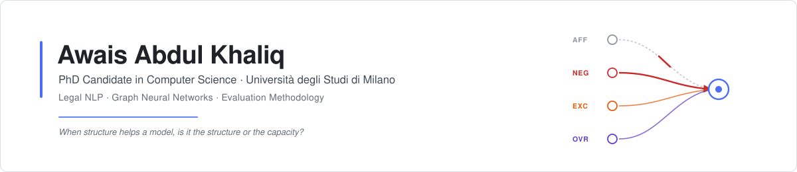

<picture>
  <source media="(prefers-color-scheme: dark)" srcset="assets/banner-dark.svg">
  
</picture>

  

Dipartimento di Informatica "Giovanni Degli Antoni" · ISLab

 

 

**Legal NLP** &nbsp;·&nbsp; **Graph neural networks** &nbsp;·&nbsp; **Retrieval-augmented generation** &nbsp;·&nbsp; **Evaluation methodology**

 

---

## The question I work on

Legal text is **defeasible**. A rule states an obligation, a later clause carves out an
exception, a superior authority overrides both. Encoding that structure explicitly, as typed
operators inside a graph neural network, ought to help a model read legal documents.

My doctoral work asks whether it actually does, and runs into a sharper question on the way:

> When you add structure to a neural model and it performs better, how do you show the
> **structure** is doing the work, rather than the **capacity** that came with it?

The answer to the first is conditional, and the conditions turn out to be narrow and
measurable. The method built to answer the second is the part that travels beyond law: a
permutation control that retrains an identical architecture on true, shuffled and removed
structure, validated across eighteen graph benchmarks.

 

---

<picture>
  <source media="(prefers-color-scheme: dark)" srcset="https://raw.githubusercontent.com/oziofficial5/oziofficial5/refs/heads/output/github-snake-dark.svg">
  
</picture>

 

---

## Repositories

<table>
<tr>
<td width="50%" valign="top">

### [jusdefv2](https://github.com/oziofficial5/jusdefv2)

Defeasibility-aware graph neural networks for legal text, and a three-arm
permutation control for deciding whether a structural prior does any work.

Ships the annotated corpus, the operator detector, and the per-seed logs
behind every reported number.

</td>
<td width="50%" valign="top">

### [Aske](https://github.com/oziofficial5/Aske)

Benchmark of a knowledge-based legal extraction pipeline against fine-tuned
transformers across the LexGLUE suite.

The result is two-sided — strong on ranking, weaker on decisions — and the
README shows both sides.

</td>
</tr>
<tr>
<td width="50%" valign="top">

### [Jusdef](https://github.com/oziofficial5/Jusdef) &nbsp;archived

The original workshop implementation, kept for provenance.

Superseded by **jusdefv2**, with the status of the numbers it reports
documented in the README.

</td>
<td width="50%" valign="top">

### Released resources

A **3,000-sentence** operator-annotated EUR-Lex corpus, its annotation
guidelines, the inter-annotator validation files, and a neural operator
detector that transfers to contract text without retraining.

All inside **jusdefv2**, all usable independently of any verdict on the
architecture.

</td>
</tr>
</table>

 

---

## Publications

### Legal NLP

<table>
<tr><td width="96" align="center" valign="middle"><b>2026</b> Elsevier</td><td>

**Evaluating Knowledge-Based Approaches for Legal Text Analysis: A Benchmark Study**
Khaliq, Riva & Montanelli · *Computer Law & Security Review* **61**:106279

</td></tr>
<tr><td align="center" valign="middle"><b>2026</b> Springer</td><td>

**JusDef: Defeasible Message Passing for Exception-Aware Legal Document Classification**
Khaliq, Montanelli, Dalianis & Naqvi · *ANNPR 2026, 12th IAPR TC3 Workshop* · LNAI

</td></tr>
<tr><td align="center" valign="middle"><b>2025</b> Springer</td><td>

**Language Models for Legal NLP: A Literature Review**
Khaliq & Montanelli · *CAiSE 2025 Workshops* · LNBIP **556**, 326–337

</td></tr>
<tr><td align="center" valign="middle"><b>—</b> Springer</td><td>

**When Does Defeasibility-Aware Neural Aggregation Help Legal Text Classification?
Separating Mechanism from Added Capacity with a Permutation Control**
Khaliq & Montanelli · *Artificial Intelligence and Law*

</td></tr>
</table>

### Computer vision and security

<table>
<tr><td width="96" align="center" valign="middle"><b>2025</b> Springer</td><td>

**Multimodal Deepfake Detection with Large Vision-Language Models: The State of the Art**
*ICIAP 2025*, 364–375 — survey of CLIP, BLIP2 and LLaVA for cross-modal
inconsistency detection

</td></tr>
<tr><td align="center" valign="middle"><b>2022</b> IEEE</td><td>

**A Secure and Privacy Preserved Parking Recommender System Using Elliptic Curve
Cryptography and Local Differential Privacy**
Khaliq, Anjum, Ajmal, Webber, Mehbodniya & Khan · *IEEE Access* **10**:56410–56426

</td></tr>
<tr><td align="center" valign="middle"><b>2021</b> IEEE</td><td>

**Last Line of Defense: Reliability Through Inducing Cyber Threat Hunting With Deception
in SCADA Networks**
Ajmal, Alam, Khaliq, Khan, Qadir & Mahmud · *IEEE Access* **9**:126789–126800

</td></tr>
</table>

 

---

## Also worked on

Research stays outside the thesis, both applied retrieval systems:

- **Clinical Graph RAG** — ontology-grounded multi-hop retrieval for clinical question
  answering over electronic health records, built at DSV, Stockholm University. Knowledge
  graph constructed from MIMIC and grounded in UMLS, SNOMED CT, ICD and RxNorm, with a
  hybrid graph-traversal and dense-retrieval layer and a GDPR-compliant de-identification
  pipeline.
- **CSIL-Assistant** — hybrid RAG assistant over a corporate document corpus, combining
  FAISS dense retrieval with BM25 and keyword indexing, with LLM-based query decomposition
  and adaptive retrieval depth.

 

---

### Built with

Legal NLP · graph neural networks · defeasible reasoning · retrieval-augmented generation · evaluation methodology · knowledge extraction

